# SmartBus - Athens Smart Bus iOS App

## Overview
SmartBus is an iOS application built with SwiftUI for a smart bus service in Athens. The app supports three user roles: Passenger, Driver, and Employee. Each role has its own set of available features, so passengers can order coffee, explore nearby landmarks, and follow the driver's live feed, while drivers and employees unlock vehicle controls and monitoring tools on top of that. Built as a university project for the UI/UX course at the University of Piraeus.

## Technologies
- **Language**: Swift
- **Framework**: SwiftUI
- **Architecture**: MVVM with ObservableObject managers
- **Platform**: iOS
- **Build Tool**: Xcode

## Features
- Three user roles (Passenger, Driver, Employee) with role-gated feature access.
- Staff login screen for drivers and employees.
- Coffee ordering: browse nearby coffee shops, add items to cart, and pay with Apple Pay, card, or cash.
- Vacuum robot service: select seats to clean, choose a cleaning mode and suction level, and track progress.
- Driver's View: real-time speed, current location, and next stop info from the driver's perspective.
- Nearby Landmarks: browse Athens attractions with audio guides, maps, and walking directions.
- Driver Assistance: speed and lane monitoring with fatigue detection and safety alerts.
- Climate Control: temperature management with live weather data and automatic setting recommendations.
- Roof Control: photovoltaic roof panel management with solar output tracking.
- Energy Dashboard: live energy consumption breakdown by system, battery status, and efficiency metrics.
- Lost items alert system that triggers after vacuum cleaning completes.
- Onboarding help screen shown on first launch, with contextual help available on every screen.

## Screenshots

<table>
  <tr>
    <td align="center">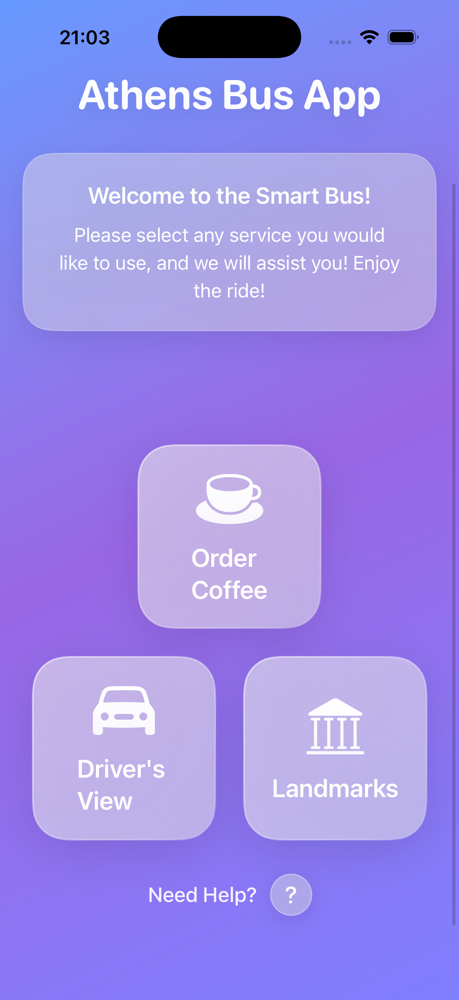<br/><sub>Home - Passenger</sub></td>
    <td align="center">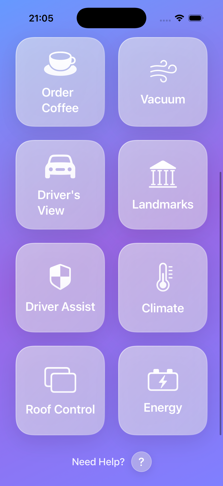<br/><sub>Home - Employee</sub></td>
    <td align="center">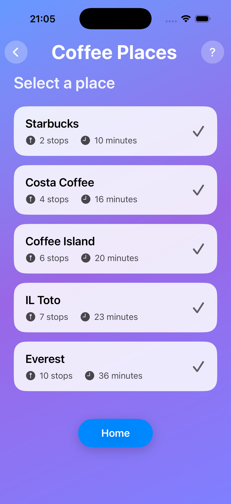<br/><sub>Coffee Places</sub></td>
  </tr>
  <tr>
    <td align="center">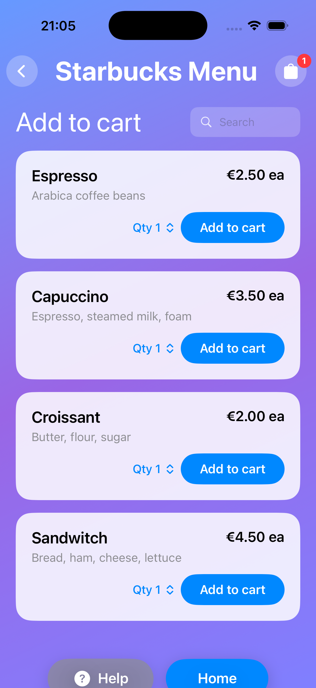<br/><sub>Coffee Menu</sub></td>
    <td align="center">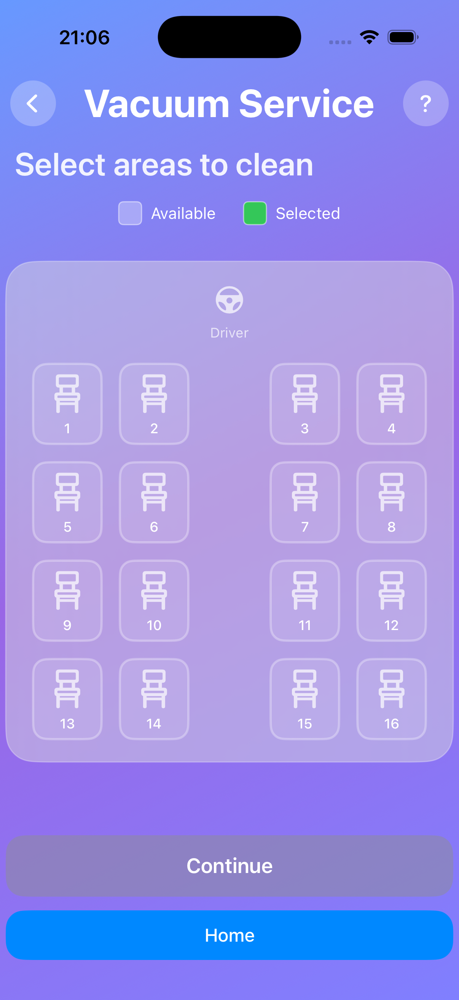<br/><sub>Vacuum Seat Selection</sub></td>
    <td align="center">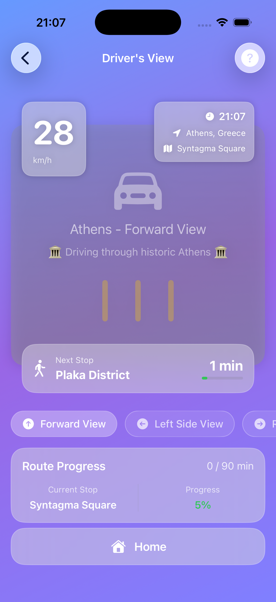<br/><sub>Driver's View</sub></td>
  </tr>
  <tr>
    <td align="center">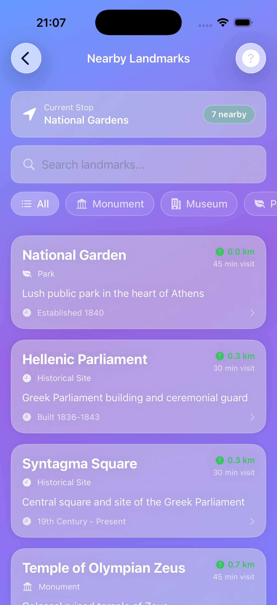<br/><sub>Nearby Landmarks</sub></td>
    <td align="center">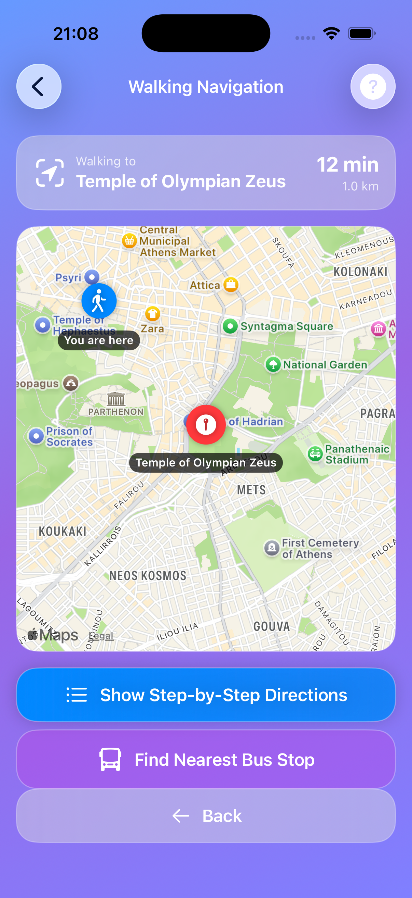<br/><sub>Walking Navigation</sub></td>
    <td align="center">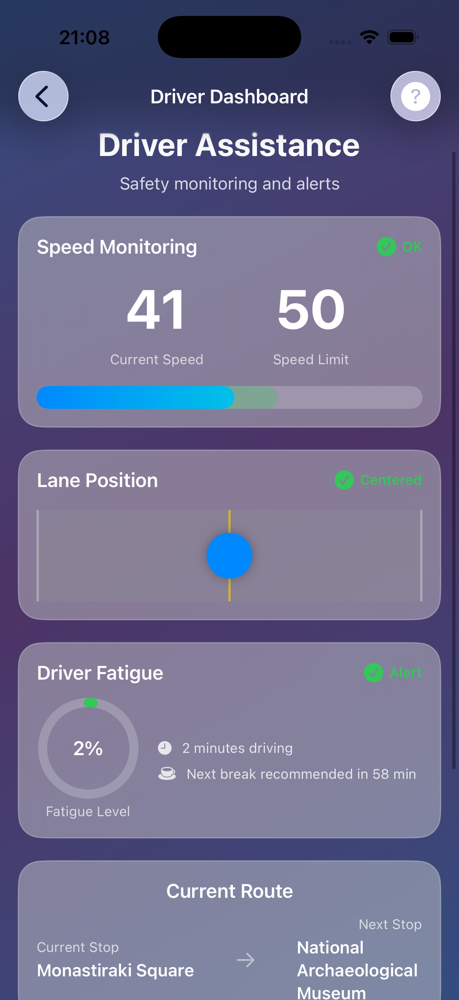<br/><sub>Driver Dashboard</sub></td>
  </tr>
  <tr>
    <td align="center">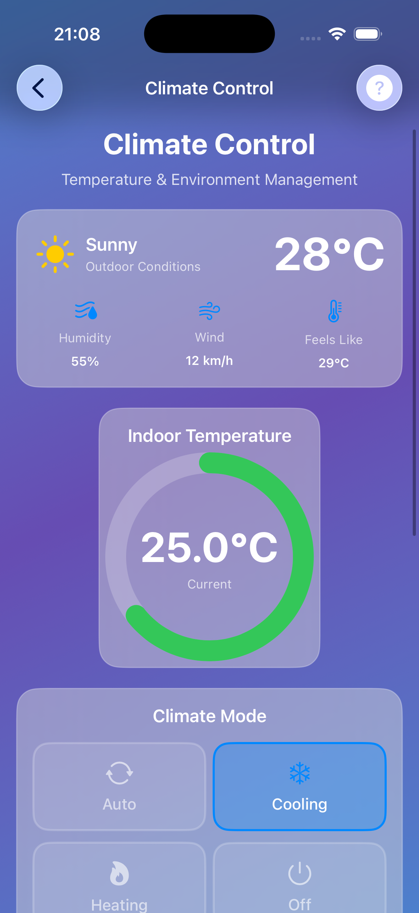<br/><sub>Climate Control</sub></td>
    <td align="center">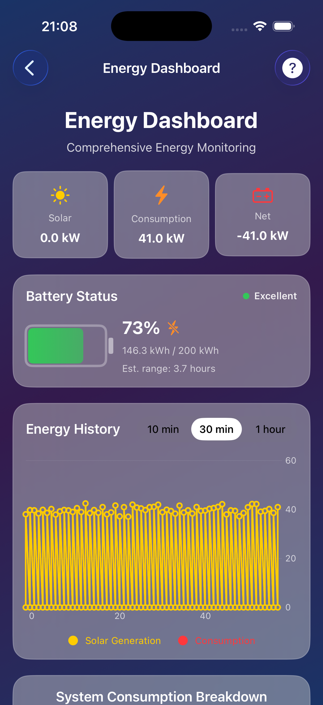<br/><sub>Energy Dashboard</sub></td>
  </tr>
</table>

## Installation
1. Clone the repository:
   ```
   git clone https://github.com/OzzYGreco/SmartBus-iOS-App.git
   ```
2. Navigate to the project directory:
   ```
   cd SmartBus-iOS-App
   ```
3. Open the project in Xcode:
   ```
   open SmartBus.xcodeproj
   ```
4. Select a simulator or a connected iOS device as the build target.
5. Build and run with `Cmd + R`.

## Usage
- **Passenger**: Open the app and pick any service from the home screen. No login needed.
- **Driver**: Tap "Staff Login" on the home screen and sign in with the driver account to unlock Driver Assist and Climate Control.
- **Employee**: Sign in with the employee account to access all features including Roof Control and Energy Dashboard.
- **Demo Credentials**:
  - Driver: `driver` / `driver123`
  - Employee: `employee` / `employee123`
- **Example Code (Role-Based Feature Access)**:
  ```swift
  func canAccess(_ feature: AppFeature) -> Bool {
      return currentRole.availableFeatures.contains(feature)
  }
  ```
- **Example Code (SwiftUI Navigation)**:
  ```swift
  GlassmorphicButton(
      title: "Order Coffee",
      icon: "cup.and.saucer.fill",
      destination: CoffeeOrderView()
  )
  ```

## Contributing
Contributions are welcome! To contribute:
1. Fork the repository.
2. Create a new branch (`git checkout -b feature-branch`).
3. Commit your changes (`git commit -m 'Add new feature'`).
4. Push to the branch (`git push origin feature-branch`).
5. Open a pull request.

## License
MIT License
